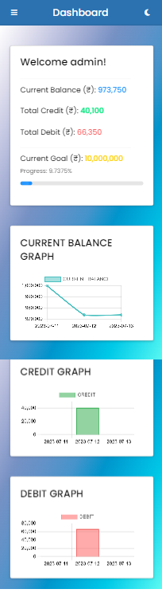
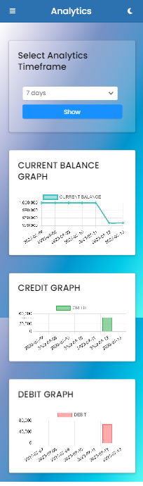
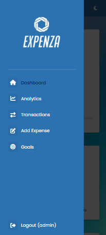
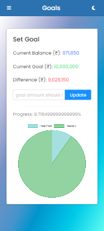
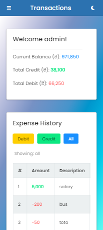
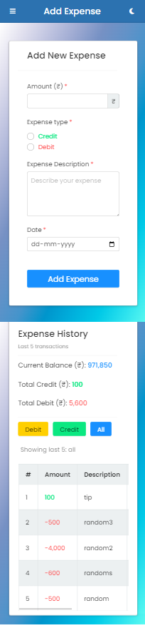
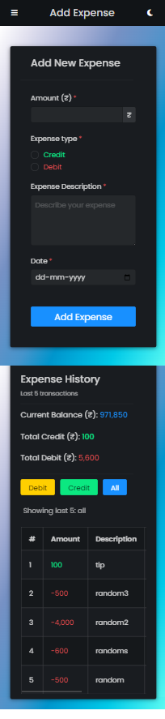
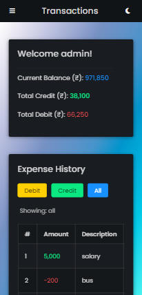
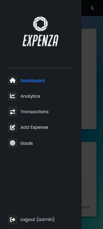
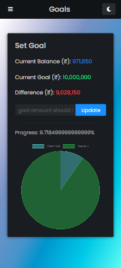

# EXPENZA - Expense Tracker


EXPENZA is a web application built with Python Flask that allows users to track their expenses. It provides a user-friendly interface for managing and categorizing expenses, providing useful insights into spending habits.

## Features

- User authentication: Users can create an account, log in, and securely manage their expenses.
- Expense tracking: Users can add, edit, and delete expenses, including details such as date, amount, category, and description.
- Categories: Users can categorize expenses into different categories for better organization and analysis.
- Reporting and analytics: EXPENZA provides graphical representations and statistical analysis of expenses, helping users gain insights into their spending patterns.
- Filtering and search: Users can filter and search expenses based on various criteria, such as date range, category, or description. 

## Installation

To install and run EXPENZA locally, follow these steps:

1. Clone the repository:

   ```bash
   git clone https://github.com/AbhinandanCodes/Expenza.git
   ```

2. Navigate to the project directory:

   ```bash
   cd expenza
   ```

3. Create and activate a virtual environment:

   ```bash
   python -m venv env
   env\scripts\activate
   ```

4. Install the required dependencies:

   ```bash
   pip install -r requirements.txt
   ```

5. Run the application:

   ```bash
   python -m main.py
   ```

6. Open your web browser and visit `http://localhost:5000` to access EXPENZA.

## Technologies Used

- Python Flask - Web framework
- SQL-Lite - Database
- HTML/CSS - Frontend
- JavaScript - Frontend logic and interactivity
- Chart.js - Data visualization
- Halfmoon.css - UI components and styling

## Screenshots

|   |   |   |   |   |
|---|---|---|---|---|
|   |   |    |   |   |

## Contributing

Contributions are welcome! If you would like to contribute to EXPENZA, please follow these steps:

1. Fork the repository.
2. Create a new branch: `git checkout -b my-feature`.
3. Make your changes and commit them: `git commit -am 'Add some feature'`.
4. Push to the branch: `git push origin my-feature`.
5. Submit a pull request.

Please ensure your code adheres to the project's coding conventions and includes appropriate tests.

## Contributors
<a href="https://github.com/vivekkushalch/expense-app/graphs/contributors">
  
</a>

## License

This project is licensed under the [MIT License](https://opensource.org/licenses/MIT).

---

Thank you for your interest in EXPENZA! We hope this expense tracker helps you manage your finances efficiently.
